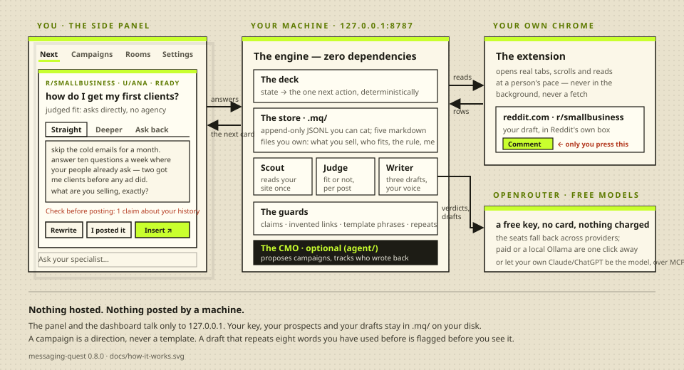

# Messaging Quest

[](https://github.com/theic/messaging-quest/actions/workflows/ci.yml)

**A marketing colleague that lives in your browser.** It finds the people on
Reddit who are asking for what you sell, writes the reply three ways in your
own voice, and puts it in the comment box for you. You press Comment. It never
does. Free to run: free models, your own Chrome, nothing hosted, no account.

## The idea, in three paragraphs

**You tell it once what you sell.** Paste your site's address on the first
card; it reads the site in a tab of your own browser and proposes three short
files — what you sell, who it is for, and the rule that decides who is worth
answering. You correct them; nothing saves itself. Nine one-tap questions
measure how you write. Then it asks for one room (say r/smallbusiness) and the
phrase somebody types when they have your problem, probes it, and watches it
only if enough of what came back fits.

**Then it works one card at a time, in a side panel.** It reads the room in
your browser at a person's pace — real tabs, never a background fetch. A judge
model scores each post against your rule. For everyone who fits, the writer
writes **three drafts**, each a different move: *Straight* (the answer, short),
*Deeper* (what is behind their question), *Ask back* (one real thing and a
question you want answered). Pick a tab, edit it, or comment on it and all
three are written again. **Insert** puts your words into Reddit's own comment
box — the thread's, never under somebody's comment — and reads back that they
landed; you read them there and press Reddit's button. Everything that runs
is named at the top of the panel, and the judge runs by itself. Nothing in
this repository can submit.

**A CMO watches the whole thing.** When somebody writes back, their reply
lands on your deck before any new person, with the next turn drafted. Once a
day it reads the numbers per campaign and proposes: pause the one that is
saturated, aim a new one at a different kind of person. A **campaign** is a
direction — an angle, a room, a tone, a rule about naming what you built —
never a template: the writer applies it to one person at a time, and the same
eight words twice is flagged before you post.

<p align="center"></p>

## Install

Node 18 or newer, and Chrome.

```bash
git clone https://github.com/theic/messaging-quest && cd messaging-quest && node bin/mq.mjs init && node bin/mq.mjs serve
```

1. `chrome://extensions` → **Developer mode** → **Load unpacked** → this
   repo's `extension/` folder. Pin the icon and click it: the panel opens.
2. The first cards ask for your Reddit username, your site's address, and a
   **free OpenRouter key** — [openrouter.ai/keys](https://openrouter.ai/keys),
   no card. Everything runs on free models unless you choose otherwise.
3. Keep `node bin/mq.mjs serve` running while you use it. That is all.

**What free means here.** Every seat — the scout that reads your site, the
judge, the writer — runs on OpenRouter's free models by default, and nothing
is ever charged. The platform's limits, read off its docs on 2026-09-01: 20
requests a minute and 50 a day on a fresh account (1,000 a day once $10 of
credit was ever bought, which is not required). A judge call covers five posts;
a reply is one call for all three drafts. Paid and Local (Ollama, nothing
leaves the machine) are one click away on the panel's Settings tab.

## The panel

Four tabs. **Next** is the deck: one card, one obvious thing to press — a
person to answer with three drafts, somebody who wrote back, a room's rules to
record, a read that is due. **Campaigns**: what you are trying, each with its
numbers, a focus for the deck, a room to search under it, pause and done.
**Rooms**: what is watched and when it was last read, a room to try. **Settings**:
where the models run, the key, the seats, your account, your projects. The
box at the bottom talks to the CMO (`npm run brain` installs it; everything else
runs without it), and under the card sit the questions people typically ask
it — what to do next, who is waiting, how a campaign is going, why this
person — one press each. When an answer needs an action, the CMO deals it as
a card rather than telling you where to click.

The dashboard at `http://127.0.0.1:8787` is the ledger behind it — Today,
People, Campaigns, You — and `node bin/mq.mjs` is the same engine from the
terminal.

## What it never does

It does not post, reply, vote, message, or read anybody else's account. It
has no verb that writes to Reddit. Every read is a real tab in your own
Chrome, rendered, at a person's pace, with Chrome's own input pipeline — the
page sees only trusted events, and a test fails the build on the first
synthetic one. Every draft is checked before you see it: a first-person claim
your notes do not support, a link that was not in the thread, a phrase nobody
types to one person, eight words you have used before. The check names it;
you decide. Everything it learns stays in `.mq/` on your disk as files you can
read with `cat`.

## Everything else

The long form — how reading works, the visibility half (what Reddit did to the
comments you already wrote), the models and their measurements, campaigns,
projects, the return loop, skills, MCP, tests — is in
[docs/reference.md](docs/reference.md). The decisions and their reasons are in
[PLAN.md](PLAN.md).

```bash
node bin/test.mjs                # the engine, the cards, the seams, the panel's routes
node --test bin/voice-test.mjs   # the voice fingerprint
node agent/test.mjs              # the runtime (needs npm run brain)
```

## Licence

ELv2 (Elastic License 2.0) — the canonical text is in [LICENSE](LICENSE). Use
it, change it, redistribute it, for yourself or your company, free. The one
thing you may not do is sell it to others as a managed service.
